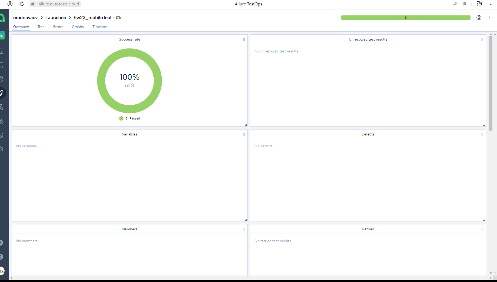

## Проект по автоматизации тестирования мобильной версии сайта [Википедия](https://ru.wikipedia.org/wiki/Заглавная_страница)
<p align="center">

</p>

## :pushpin: Содержание:

- [Использованный стек технологий](#computer-использованный-стек-технологий)
- [Список авто тестов](#tests-список-авто/ручных-тестов)
- [Список проверок, реализованных в автотестах](#arrow_forward-запуск-тестов-из-терминала)
- [Запуск тестов из терминала](#arrow_forward-запуск-тестов-из-терминала)
- [Сборка в Jenkins](#сборка-в-jenkins)
- [Пример Allure-отчета](#пример-allure-отчета)
- [Уведомления в Telegram с использованием бота](#уведомления-в-telegram-с-использованием-бота)
- [Видео примера запуска тестов в Selenoid](#-видео-примера-запуска-теста-в-selenoid)

  ## :computer: Использованный стек технологий
  
 <p align="center">
<a href="https://www.jetbrains.com/idea/"></a>
<a href="https://appium.io/docs/en/latest/"></a>
<a href="https://www.browserstack.com/"></a>
<a href="https://www.java.com/"></a>
<a href="https://github.com/allure-framework"></a>
<a href="https://gradle.org/"></a>
<a href="https://junit.org/junit5/"></a>
<a href="https://github.com/"></a>
<a href="https://www.jenkins.io/"></a>
<a href="https://web.telegram.org/"></a>
<a href="https://www.atlassian.com/software/jira/"></a> 
</p>

- В проекте автотесты написаны на языке <code>Java</code> с использованием фреймворка для тестирования [Selenide](https://selenide.org/).
- Для сборки проекта в интегрированной среде разработки IntelliJ IDEA используется сборщик проектов <code>Gradle</code>.  
- Для модульного тестирования приложения используется фреймворк <code>JUnit 5</code>.
- Для локального тестирования приложения на мобильных устройствах используется Android Studio и Appium
- Для удаленного тестирования в различных платформах Browserstack
- Allure Report, AllureTestOps и Telegram Bot используются для визуализации результатов тестирования
  
## Список авто тестов
**При запуске удаленно:**
- [x] Проверка обнаружения результатов поиска
- [x] Открытие первой найденной ссылки
- [x] Проверка краткого описания статьи

**При запуске локально:**
- [x] Проверка обнаружения результатов поиска

## :arrow_forward: Запуск автотестов

### Запуск тестов на удаленном браузере
Локальный запуск тестов
```
gradle clean local_test -DdeviceHost=local

```
Запуск удаленно:
```
gradle clean remote_test -DdeviceHost=remote

```

##  Созданный проект в [Jenkins](https://jenkins.autotests.cloud/job/hw23_mobileTest/)
<p align="center">

</p>

##  Пример [Allure-отчета](https://jenkins.autotests.cloud/job/hw23_mobileTest/5/allure/)
В отчете отображены пройденные автотесты. На приложенном изображении открыт тест кейс, отображены его шаги, прикреплены логи, скрины и видео
<p align="center">

</p>

## Интеграция с [Allure TestOps](https://allure.autotests.cloud/launch/35268)

Выполнена интеграция сборки <code>Jenkins</code> с <code>Allure TestOps</code>.
Результат выполнения автотестов отображается в <code>Allure TestOps</code>
На Dashboard в <code>Allure TestOps</code> отображена статистика пройденных тестов.

<p align="center">

</p>

##  Интеграция с [Jira](https://jira.autotests.cloud/browse/HOMEWORK-1094)

Реализована интеграция <code>Allure TestOps</code> с <code>Jira</code>, в тикете отображается информация, какие тест-кейсы были написаны в рамках задачи и результат их прогона.

<p align="center">

</p>

##  Уведомления в Telegram с использованием бота

После завершения сборки, бот созданный в <code>Telegram</code>, автоматически обрабатывает и отправляет сообщение с результатом.

<p align="center">

</p>

## Видео примера запуска тестов в Selenoid

К каждому тесту в отчете прилагается видео прогона.
<p align="center">
  
</p>
